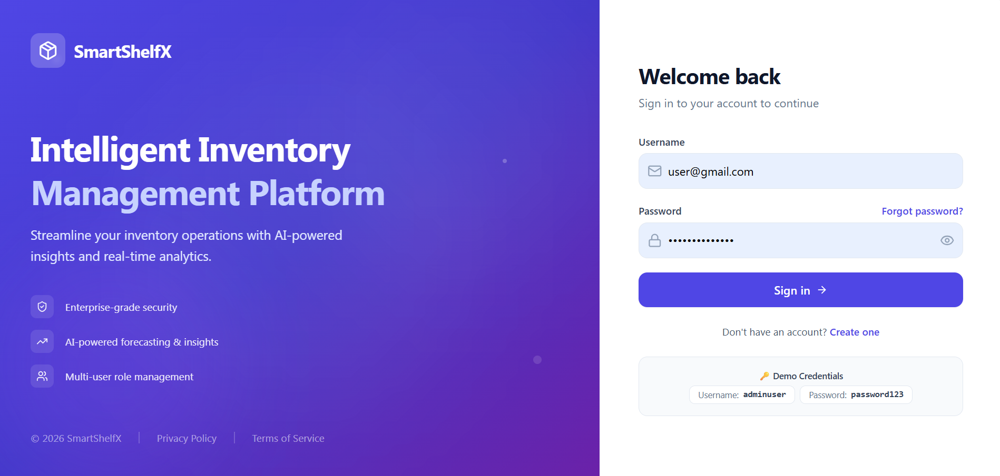
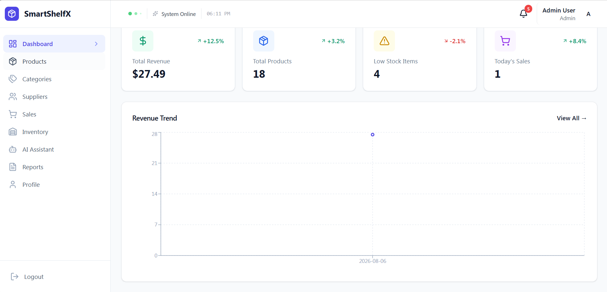
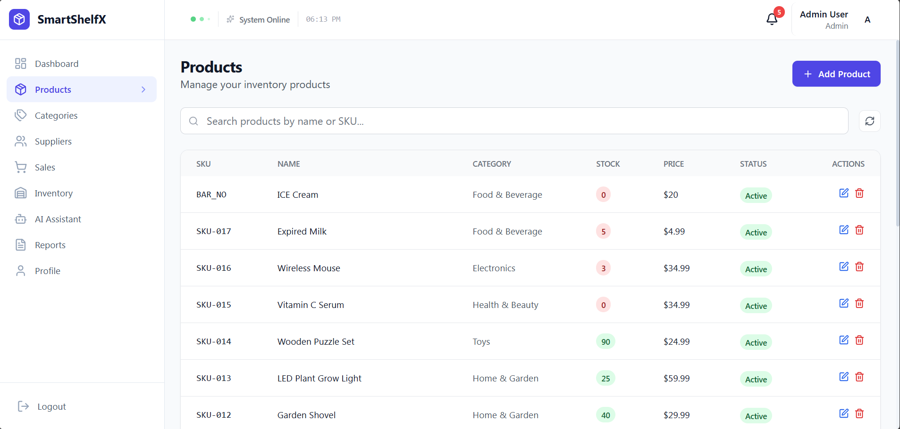
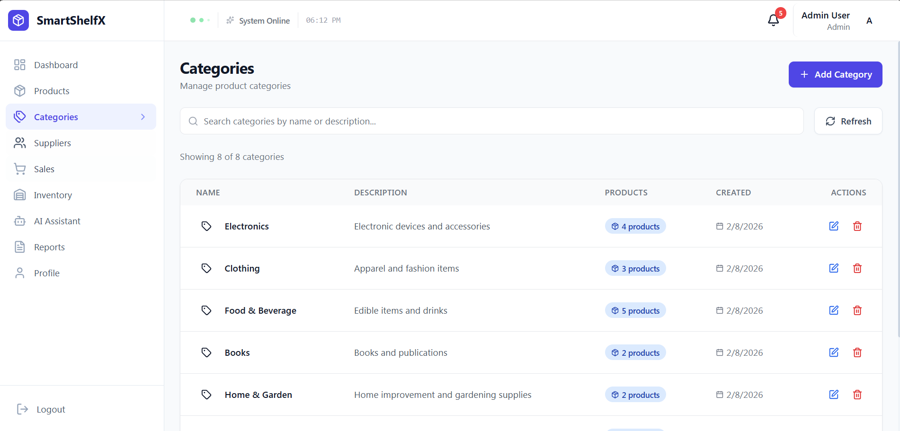
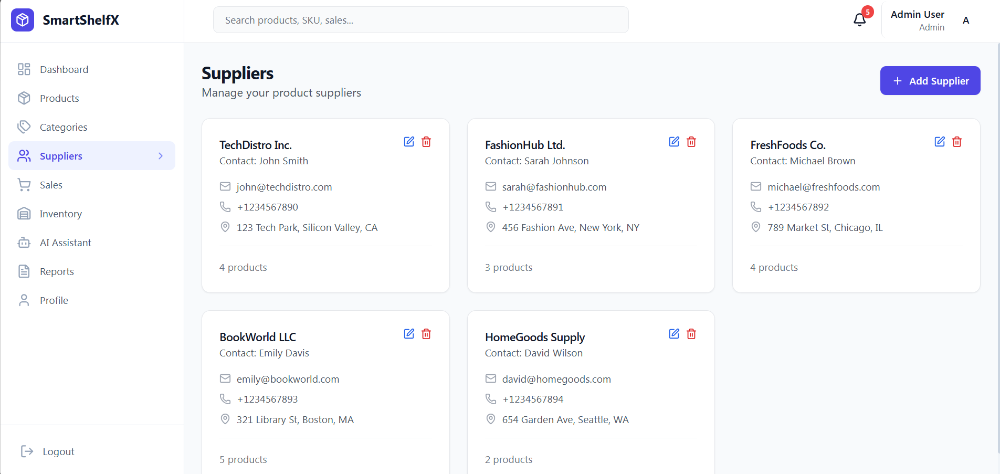
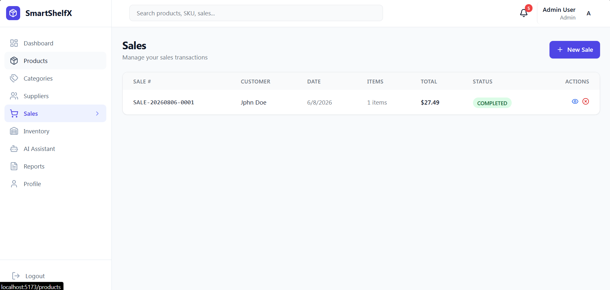
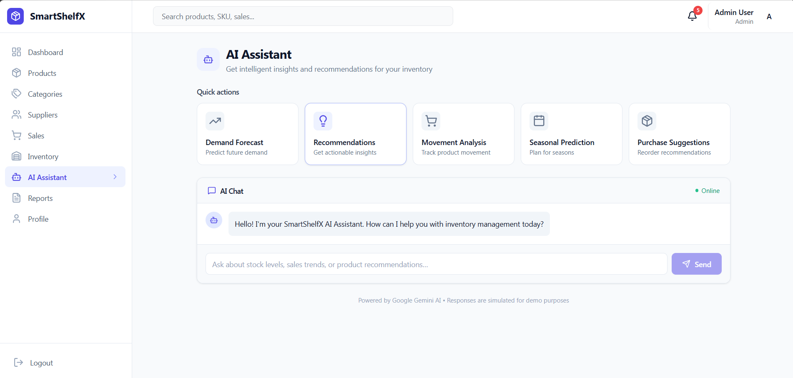
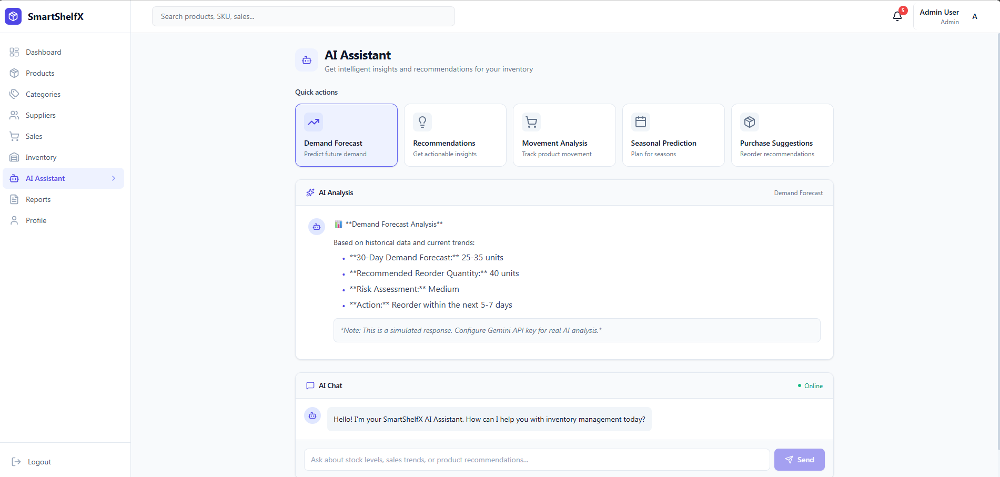
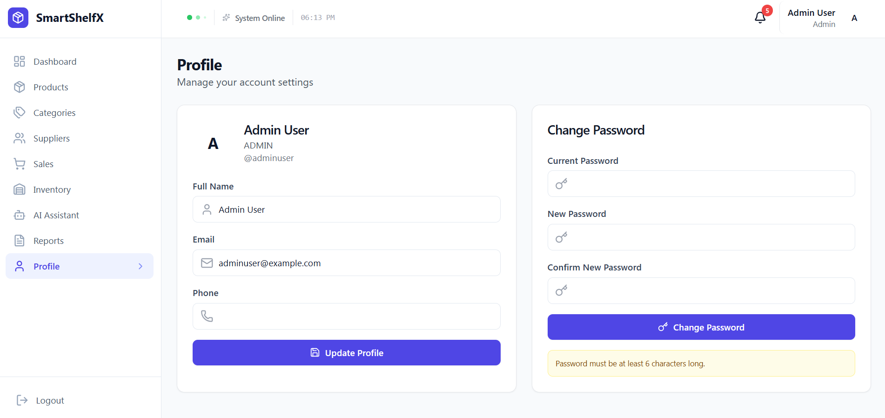

# 📦 SmartShelfX — AI-Powered Inventory Management System

SmartShelfX is a full-stack, AI-powered inventory management platform that helps businesses streamline inventory operations with intelligent insights and real-time analytics. It pairs a robust Spring Boot backend with a modern, responsive React frontend.



---

## 📑 Table of Contents

- [Key Features](#-key-features)
- [Technology Stack](#️-technology-stack)
- [Screenshots](#-screenshots)
- [Architecture Overview](#-architecture-overview)
- [Prerequisites](#-prerequisites)
- [Getting Started](#-getting-started)
- [Demo Credentials](#-demo-credentials)
- [User Roles](#-user-roles)
- [Future Enhancements](#-future-enhancements)

---

## ✨ Key Features

### 📊 Smart Dashboard
- Real-time KPI tracking (Revenue, Products, Low Stock, Sales)
- Interactive revenue charts with trend analysis
- Visual inventory health indicators
- Quick stats at a glance

### 📦 Inventory Management
- Complete CRUD operations for Products, Categories, and Suppliers
- Real-time stock level tracking
- Low stock and out-of-stock alerts
- Product search and filtering

### 🛒 Sales Management
- Create and manage sales transactions
- Automatic stock deduction
- Customer management
- Order history and status tracking

### 📈 Inventory Movements
- Track stock movements (IN / OUT / TRANSFER / DAMAGE)
- Complete audit trail
- Movement history by product
- Reference tracking (sales, purchases, adjustments)

### 🤖 AI-Powered Insights
- Demand forecasting using Google Gemini AI
- Smart inventory recommendations
- Seasonal trend predictions
- Purchase suggestions
- AI chat assistant for inventory queries

### 📋 Reports & Export
- Export product reports to CSV
- Sales reports with date filtering
- Low stock reports
- Inventory movement reports

### 🔔 Smart Notifications
- Real-time alerts for low stock
- Expiry notifications
- System notifications
- Mark as read / mark all read functionality

### 🔐 Security & Authentication
- JWT-based authentication
- Role-based access control (Admin, Manager, Employee)
- Secure password hashing with BCrypt
- Protected API endpoints

---

## 🛠️ Technology Stack

### Backend

| Technology | Purpose |
|---|---|
| Java 21 | Core programming language |
| Spring Boot 3.4 | Backend framework |
| Spring Security | Authentication & authorization |
| Spring Data JPA | Database ORM |
| PostgreSQL 16 | Production database |
| JWT | Secure token-based authentication |
| BCrypt | Password encryption |
| Maven 3.9 | Build automation |

### Frontend

| Technology | Purpose |
|---|---|
| React 18 | UI framework |
| Vite 5 | Build tool |
| Tailwind CSS 3 | Styling |
| Zustand | State management |
| Recharts | Data visualization |
| React Router | Navigation |
| Axios | HTTP client |
| React Hot Toast | Notifications |

### AI Integration

| Technology | Purpose |
|---|---|
| Google Gemini 1.5 Flash | AI-powered insights |
| REST API | AI service integration |

---

## 📸 Screenshots

**Login**


**Dashboard**


**Products**


**Categories**


**Suppliers**


**Sales**


**AI Assistant**



**Profile**


---

## 🏗️ Architecture Overview

```
SmartShelfX/
├── backend/                 (Spring Boot)
│   ├── Controllers          (REST API endpoints)
│   ├── Services             (Business logic)
│   ├── Repositories         (Data access)
│   ├── Entities              (Database models)
│   └── Security              (JWT & Auth)
│
├── frontend/                (React + Vite)
│   ├── Pages                (Dashboard, Products, Sales, AI, etc.)
│   ├── Components           (Layout, UI elements)
│   ├── Context               (State management)
│   └── API                   (HTTP client)
│
└── Database (PostgreSQL)
    ├── Users & Roles
    ├── Products & Categories
    ├── Sales & Inventory
    └── Notifications
```

### Key Modules

1. **Authentication Module** — Registration, login, JWT token management, role-based access, profile management
2. **Product Management** — SKU-based tracking, barcode support, category/supplier association, stock & reorder levels
3. **Sales Processing** — Real-time stock validation, automatic inventory updates, discount/tax calculation, payment tracking
4. **Inventory Tracking** — Complete audit log, stock movement history, product lifecycle, damage/transfer management
5. **Analytics Dashboard** — Revenue analytics, product performance, category distribution, inventory health metrics
6. **AI Assistant** — Demand forecasting, smart recommendations, seasonal predictions, purchase optimization

---

## ✅ Prerequisites

Before you begin, make sure you have the following installed:

- **Java 21** (JDK)
- **Maven 3.9+**
- **Node.js** (v18 or later) and **npm**
- **PostgreSQL 16**
- A **Google Gemini API key** (optional, for live AI responses — without it the AI Assistant runs in simulated demo mode)
- **Git**

---

## 🚀 Getting Started

Follow these steps in order to get SmartShelfX running locally.

### 1. Clone the repository

```bash
git clone https://github.com/ghanaswamy5/SmartShelfX.git
cd SmartShelfX
```

### 2. Set up the PostgreSQL database

Create a database named `smartshelfx`, then run the initialization script:

```bash
psql -U postgres -c "CREATE DATABASE smartshelfx;"
psql -U postgres -d smartshelfx -f init.sql
```

> Update your database URL, username, and password in the backend's `application.properties` (or `application.yml`) file to match your local PostgreSQL setup.

### 3. Configure environment variables

Copy/update `setenv.bat` (or create an equivalent `.env`/shell script on macOS/Linux) with your credentials, for example:

```bash
DB_URL=jdbc:postgresql://localhost:5432/smartshelfx
DB_USERNAME=postgres
DB_PASSWORD=your_password
JWT_SECRET=your_jwt_secret
GEMINI_API_KEY=your_gemini_api_key   # optional
```

### 4. Run the backend

```bash
cd backend
mvn clean spring-boot:run
```

The backend API will start on `http://localhost:8080` (default Spring Boot port, confirm against your config).

### 5. Run the frontend

Open a new terminal:

```bash
cd frontend
npm install
npm run dev
```

The frontend will start on `http://localhost:5173` (default Vite port).

### 6. Open the app

Visit `http://localhost:5173` in your browser and sign in using the [demo credentials](#-demo-credentials) below, or create a new account.

---

## 🔑 Demo Credentials

| Role | Username | Password |
|---|---|---|
| Admin | `adminuser` | `password123` |
| Manager | `manager` | `password123` |
| Employee | `employee` | `password123` |

---

## 👥 User Roles

| Role | Permissions |
|---|---|
| **Admin** | Full system access, manage users, delete data |
| **Manager** | Manage inventory, sales, reports |
| **Employee** | Process sales, view inventory |

---

## 🌟 Highlights

- ✅ **Modern Tech Stack** — Built with the latest technologies
- ✅ **AI Integration** — Powered by Google Gemini AI
- ✅ **Beautiful UI** — Professional, responsive design
- ✅ **Real-time Updates** — Live dashboard and notifications
- ✅ **Secure** — JWT authentication and role-based access
- ✅ **Scalable** — Modular architecture for easy expansion
- ✅ **Well-Documented** — Clean, maintainable code

---

## 📈 Future Enhancements

- 📱 Mobile app support
- 📊 Advanced analytics and reporting
- 🔔 Email notifications
- 💳 Payment gateway integration
- 📦 Multi-warehouse support
- 🏷️ Barcode scanning
- 📱 QR code generation
- 🔄 Third-party integrations (Shopify, WooCommerce, etc.)

